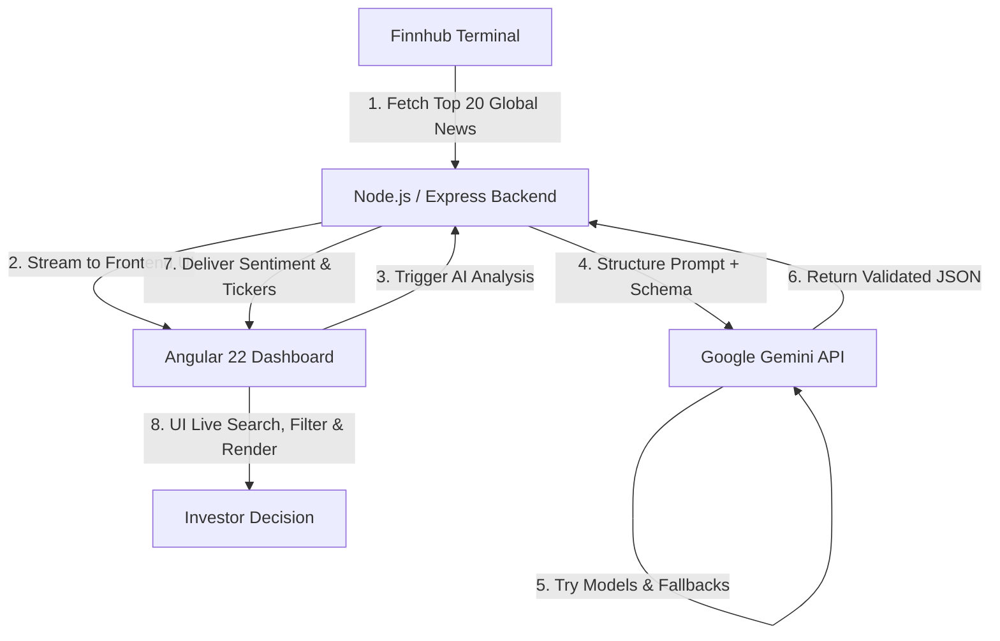

# 📈 What's Up Stocks? — AI-Driven Fundamental News Stocks Analyser

[](https://whats-up-stocks.vercel.app/)
[](https://angular.dev/)
[](https://nodejs.org/)
[](https://ai.google.dev/)
[](LICENSE)

**What's Up Stocks** is a real-time, fundamental news sentiment analyzer and swing trading stock recommendation pipeline designed specifically for the Indian stock markets (**NSE & BSE**). By bridging the gap between global macroeconomic events and local market action, the app extracts live financial news and passes it through an advanced AI reasoning pipeline to identify potential catalysts, directional momentum, and relevant tickers.

🔗 **Live Deployment:** [https://whats-up-stocks.vercel.app/](https://whats-up-stocks.vercel.app/)

---

## 🔍 How It Works (The Analytical Pipeline)

The application utilizes a two-phase analytical pipeline to turn raw news into actionable intelligence:



1. **Phase 1: Raw News Fetching:** On landing, the app queries the **Finnhub News API** via our backend to retrieve the 20 most recent global and market-related news headlines. This ensures low-latency and immediate visual responsiveness.
2. **Phase 2: AI-Powered Sentiment & Ticker Mapping:** When the user clicks **Run AI Analysis**, the headlines are compiled and sent to the **Google Gemini API** backend. The AI categorizes each article into one of three classifications (*Good news*, *Bad news*, *No change*), maps them to specific publicly traded Indian stock tickers (e.g. `RELIANCE`, `TCS`, `HDFCBANK`), and provides a 2-sentence rationale for the short-term impact.

---

## ⚡ Key Features

*   📰 **Live News Syncing:** Instant retrieval of the 20 latest global financial and corporate developments.
*   🧠 **Gemini-Powered Sentiment Engine:** Direct integration with Google Gemini's reasoning models to filter, evaluate, and categorize news.
*   🇮🇳 **NSE/BSE Ticker Mapping:** Dynamic mapping of global macroeconomic news to specific Indian equity tickers likely to experience short-term directional movement.
*   🛡️ **Multi-Model Backend Resiliency:** Built-in backend redundancy with an automated fallback mechanism cycling through up to 10 Gemini models (from `gemini-3.5-flash` down to reasoning backups) to ensure maximum API uptime.
*   🔍 **Instant Client-Side Search & Filtering:** Filter articles instantly by sentiment (Bullish / Bearish / Neutral) or query specific tickers, keywords, and headlines in real-time.
*   🎨 **Premium Glassmorphic UI:** Modern dashboard utilizing a responsive, dark-mode design with glowing status badges and smooth micro-animations.
*   ⚖️ **Financial Disclaimer Banner:** Built-in transparency clarifying AI processing models and displaying crucial regulatory notices (e.g., non-SEBI registered status).

---

## 🛠️ Technologies Used

### Frontend
*   **Framework:** [Angular 22](https://angular.dev/) (Standalone Components, Signals-based state management, and Computed values)
*   **Styling:** Modern Vanilla CSS (Glassmorphism, custom scrollbars, CSS variables, CSS grid layouts, glowing keyframes)
*   **Build Tools:** Angular CLI & Vitest

### Backend
*   **Server Environment:** Node.js (ES Modules syntax)
*   **Framework:** Express.js
*   **SDK:** `@google/genai` (Google's official Next-Gen generative AI developer kit)
*   **HTTP Client:** Axios (for fast news retrieval)
*   **Redundancy / Flow Control:** Fallback loop logic over 10 model variants

---

## 🔌 Public APIs Used

1.  **[Finnhub News API](https://finnhub.io/)**: Used to retrieve real-time general market news headlines and description summaries.
2.  **[Google Gemini API](https://ai.google.dev/)**: Used to conduct structured sentiment analysis on the retrieved headlines and output structured JSON matching the application's layout requirements.

---

## 📂 Project Structure

```text
stock-recommender-app/
├── backend/                # Express.js Server
│   ├── server.js           # Server logic, API routing, Gemini fallback pipeline
│   ├── package.json        # Node dependencies & start scripts
│   └── vercel.json         # Vercel Serverless Function configuration
└── frontend/               # Angular 22 Client
    ├── src/
    │   ├── app/
    │   │   ├── app.ts      # Main component with Angular signals
    │   │   ├── app.html    # Glassmorphic layout template
    │   │   ├── app.css     # Theme & layout stylesheets
    │   │   └── services/   # HTTP connection service to backend
    │   └── main.ts         # Angular client bootstrapper
    ├── angular.json        # Angular build & assets config
    ├── package.json        # Frontend scripts & dependencies
    └── vercel.json         # Frontend routing & serverless proxy config
```

---

## 🚀 Local Installation & Setup

To run both the frontend and backend of this application on your local machine, follow these steps:

### Prerequisites
*   [Node.js](https://nodejs.org/) (v18 or higher recommended)
*   A [Finnhub API Key](https://finnhub.io/) (free tier available)
*   A [Google Gemini API Key](https://ai.google.dev/)

### 1. Set Up the Backend
1.  Navigate into the `backend/` directory:
    ```bash
    cd backend
    ```
2.  Install dependencies:
    ```bash
    npm install
    ```
3.  Create a `.env` file in the `backend/` directory and populate it with your keys:
    ```env
    PORT=3000
    FINNHUB_API_KEY="your-finnhub-api-key"
    GEMINI_API_KEY="your-gemini-api-key"
    ```
4.  Start the development server:
    ```bash
    npm run dev
    ```
    The backend server will start at `http://localhost:3000`.

### 2. Set Up the Frontend
1.  Open a new terminal and navigate to the `frontend/` directory:
    ```bash
    cd frontend
    ```
2.  Install dependencies:
    ```bash
    npm install
    ```
3.  Start the local Angular development server:
    ```bash
    npm start
    ```
4.  Open your browser and navigate to `http://localhost:4200/`.

*Note: The frontend contains a `proxy.conf.json` that redirects any requests targeting `/api` directly to your local backend at `http://localhost:3000` when running locally.*

---

## ⚠️ Disclaimer

*This analysis is purely for swing trading purposes. Market news has highly volatile short-term impacts that can reverse rapidly. We are **NOT** SEBI registered advisors. This output is an AI-generated text analysis and does **NOT** constitute formal financial advice. Use your own knowledge and due diligence before making any trade decisions. The authors hold zero liability for financial actions taken based on this tool.*
